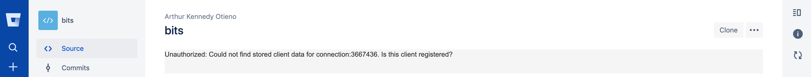

Now your app should be  running on 

https://[[HOST_SUBDOMAIN]]-3000-[[KATACODA_HOST]].environments.katacoda.com 

Now add this URL inside your `config.json` *development* section by replacing the `https://ngrok-url` URL given as : 
```json
 "localBaseUrl": "https://ngrok-url"
```  
with your URL.  

You need to create a `credentials.json`file to authenticate your addon. 

`touch credentials.json`{{execute}}

Open it and paste the following

<pre class="file" data-filename="credentials.json" data-target="replace">
{
    "hosts": {
        "connect-ace.atlassian.net": {
            "product": "bitbucket",
            "username": "",
            "password": ""
        }
    }
}
</pre> 


Otherwise you'll get the following error  
 

Now to populate this you need to head over to [https://id.atlassian.com/manage/api-tokens](https://id.atlassian.com/manage/api-tokens)

Create a *New Token* and click on *View* and copy your API Token into the  password field of the `credentials.json` file. Your username is your email. 

`npm run dev`{{execute}} 