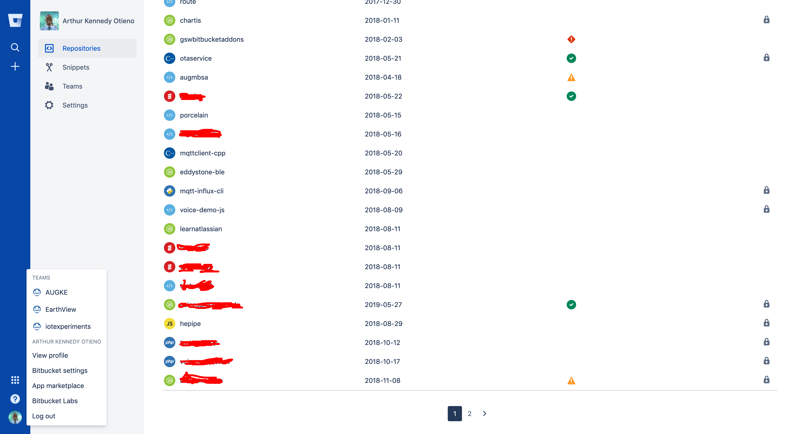
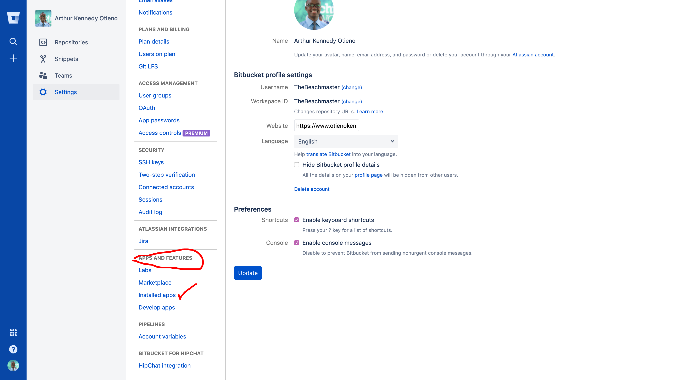
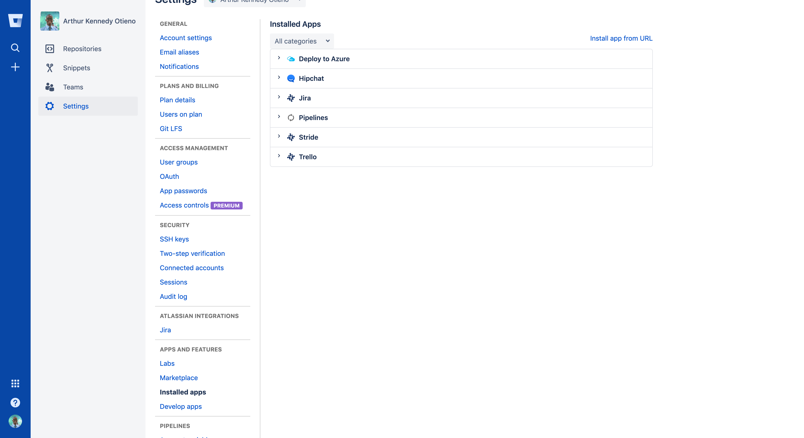
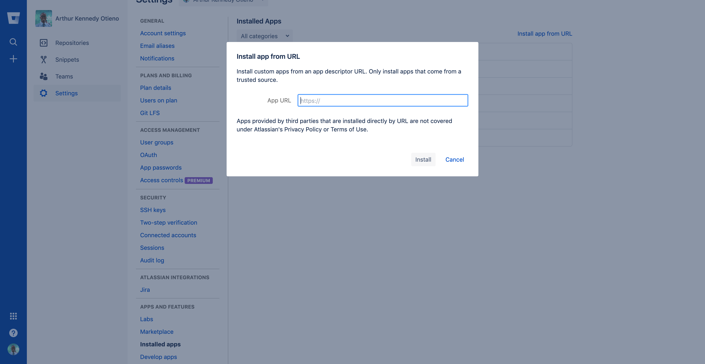

Let's change the application key inside `
atlassian-connect.json` as well as the name.  

> Without changing this, your app installation will fail 

To start using your add-on, navigate to your Bitbucket Settings page:
 

Under *APPS AND FEATURES* , select *Installed apps* 
  

Next, click on the *Install app from URL* link 
 

Next, paste the link https://[[HOST_SUBDOMAIN]]-3000-[[KATACODA_HOST]].environments.katacoda.com  
into the input field.  

 
 

Now, back to our application, let's rename the pages and panels : 

Under the `repoPages` section inside `atlassian-connect.json` change the name to something unique. Like `Repo Pages`. 

If you had done this tutorial before, you need to change the `key` and delete the app from Bitbucket apps.

