Bamboo is a [Continuous Integration](https://www.otienoken.me/devops/devops-with-bitbucket-pipelines/) server hosted on premise that enables one to **build, test and deploy** software on production servers.

The Bamboo workflow consists of **projects** , **plans** and **jobs** .