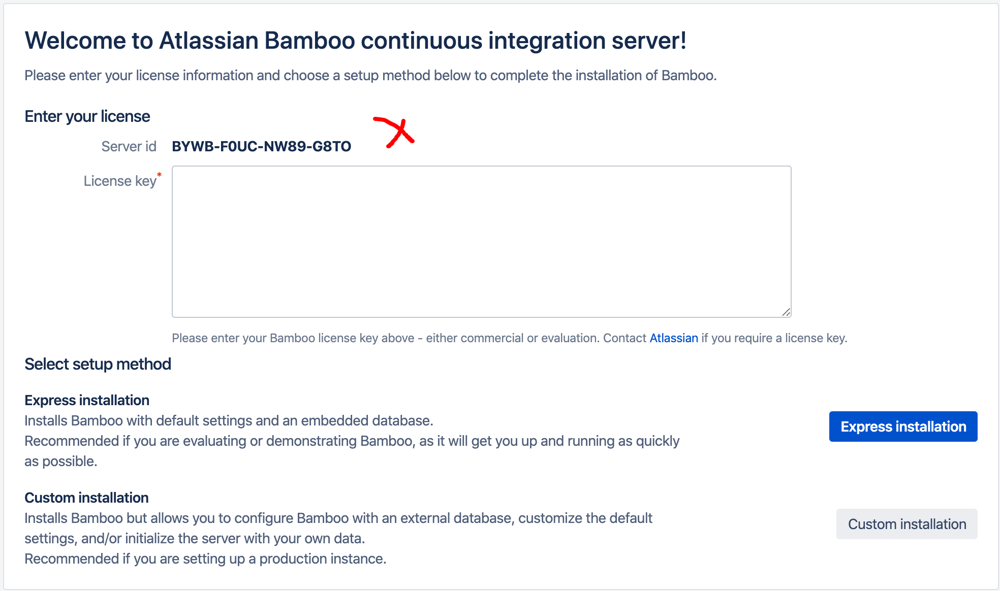
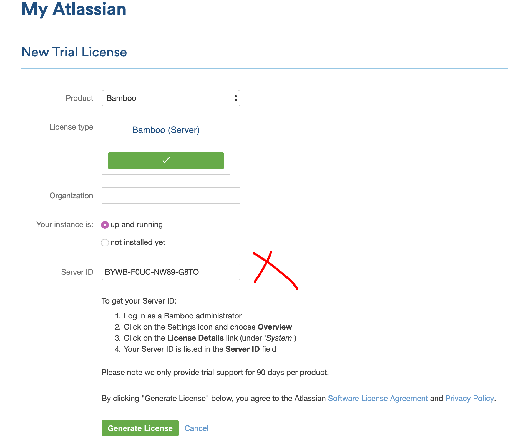
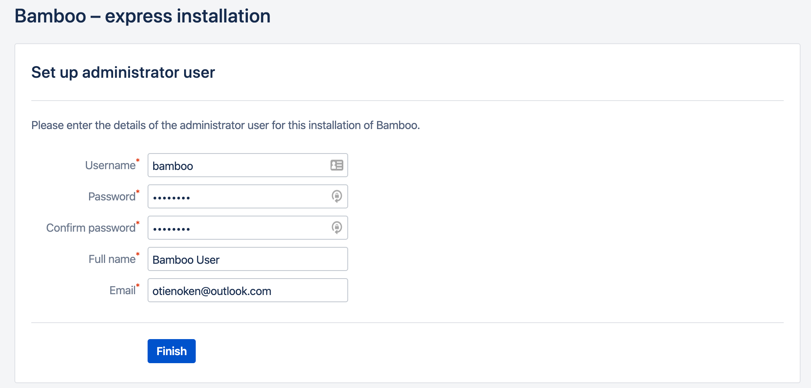

In this session we'll run Bamboo server in evaluation mode.

First, we'll need an evaluation license for the given

We can obtain one from [here](https://my.atlassian.com/license/evaluation)

Select the product you're obtaining the license for, in this case Bamboo.

Fill in the _Server ID_ and an _organization name_.

Paste the Key in the _License Key_ field.

Click on the **Express Installation** button to proceed.

Fill in the Admin credentials fields and click on **Finish** and proceed to administration.

