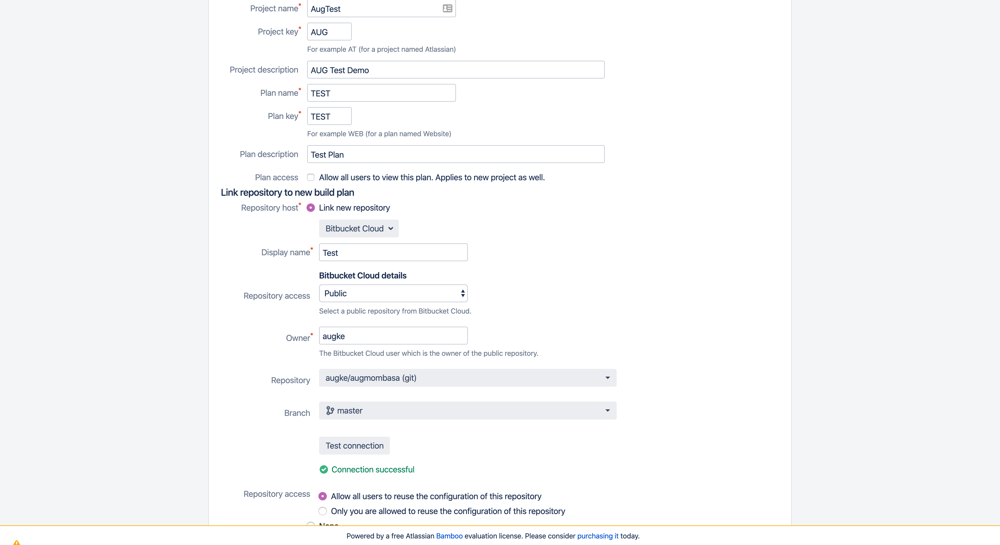

We'll start with creating our first Build plan.

Click on **Create first build plan**  and fill in the plan details.

*We'll add a repo later*

In the plan configuration dialog, key in the details, including path to repository.

If you are accessing a private Repo ensure you have filled in the credentials.

The click on **Configure Plan**

Next we configure job.

In this case we'll run the job in a Docker container.

Configure you task to perform a build and or deployment or otherwise. Then **Create**